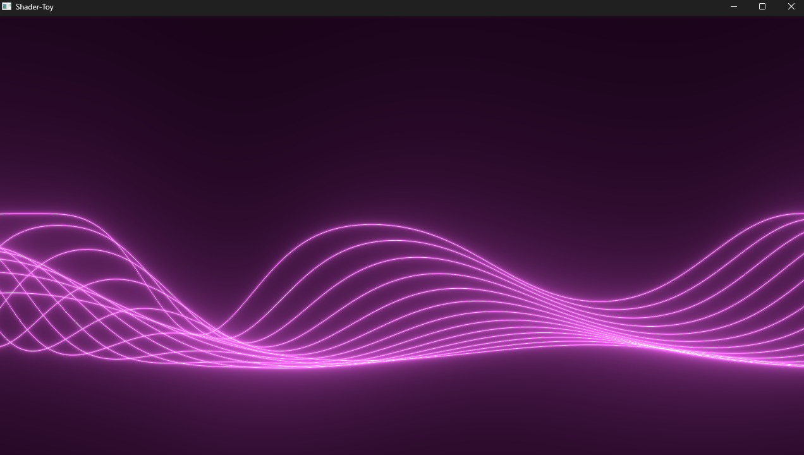
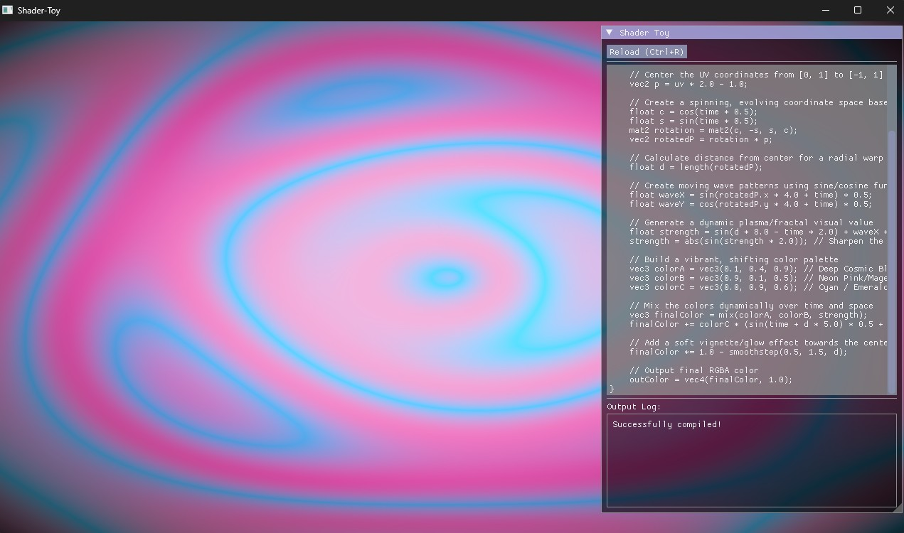
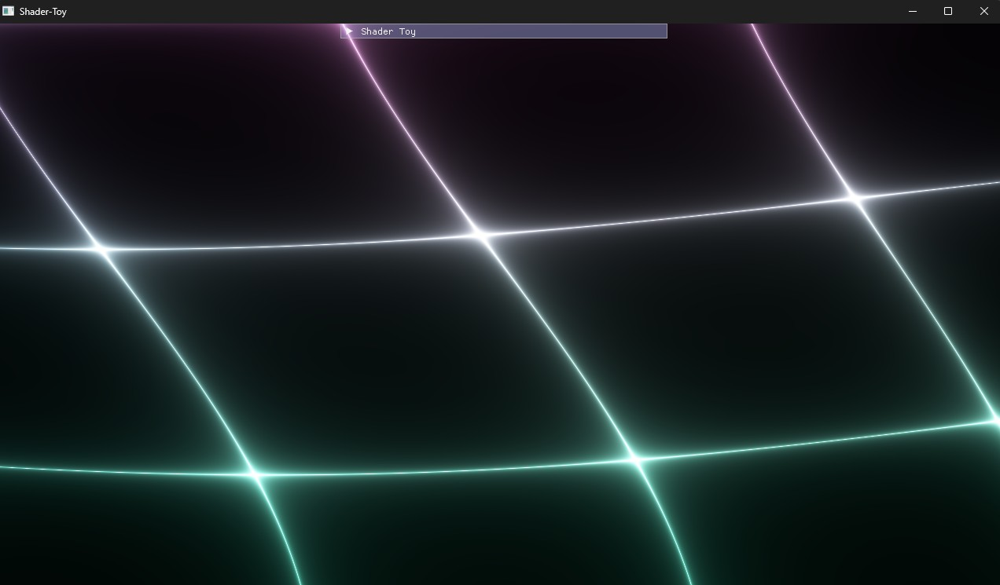
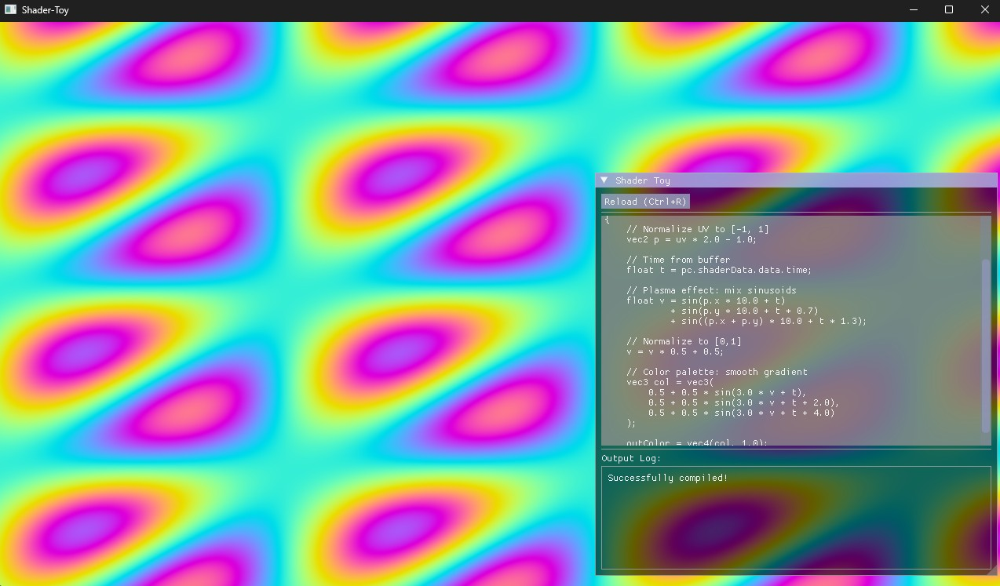

# Shader Toy

Shader Toy application built with Vulkan 1.3 dynamic rendering, this project provides a lightweight playground for experimenting with GLSL shaders in real-time.

## Showcase

  
  

  
  

## Features
- Vulkan 1.3 backend
- Runtime GLSL to SPIR-V compilation
- UI text editor and reloading button

## Dependencies
- Vulkan 1.3
- SDL3
- ShaderC
- ImGui
- CMake
- C++ 20

## Build Instructions
- Clone the repository using recursive pull
- Run VCPKG bootstrap
- Run `vcpkg install` command to pull the dependencies mentioned in manifest file.
- Configure CMake
- Build